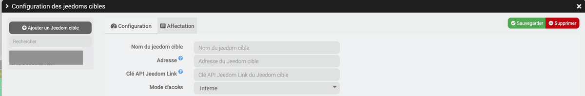
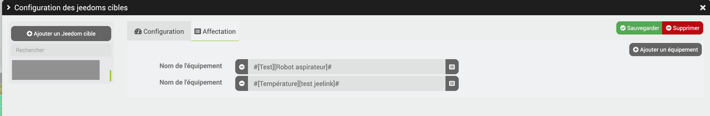
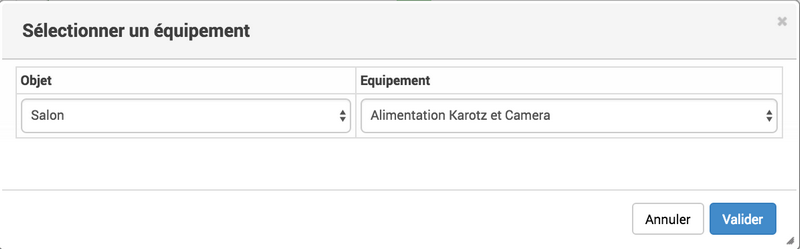
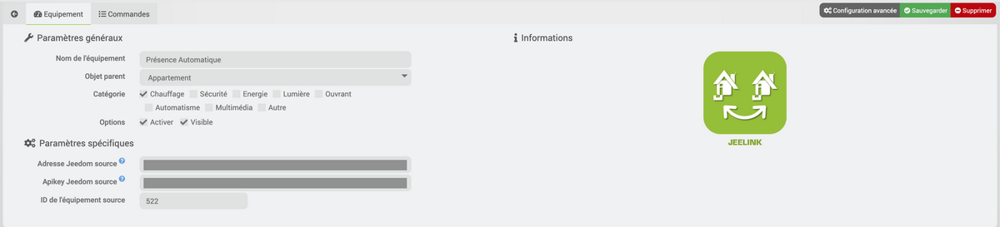
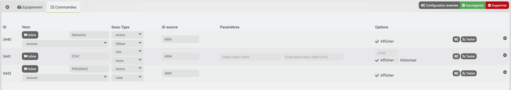

 
=======

Descrição 
-----------

 
==========================

.

> ****
>
> 
> .

> ****
>
> 
>  :
> 
> **** : 
>  ****
> 
> **** : 
>  ****
> O **** 
> **** 
> 
> **** :  ****
>  **
> **

> ****
>
>  :
> 
>  ****.
> 
>  ****.

Configuração do plugin 
=======================

. 
.

 
================================

 ****, 

".

 ****.

 ****,  :

-    ****.

-    ****.

-    ****.

-   
     ****  **
    **.

> ****
>
>  **** 
> 
> .

 
===========================

 **** 
****, 
 ****. 

 ****.

 ****.

 :

> ****
>
> Atenção : 
> O **** .

> ****
>
> 
> ****  **
> Fonte**, .

" 
==============================

 ****, 
 :

 :

 
==========================================

,

. 

.

-   

-   

-   .

=============================

,
[ici](https://jeedom.github.io/documentation/howto/fr_FR/jeelink.migration.html)

.

 
===

>****
>
>
